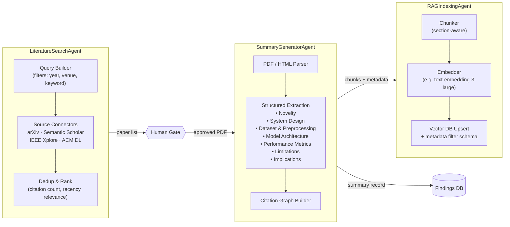
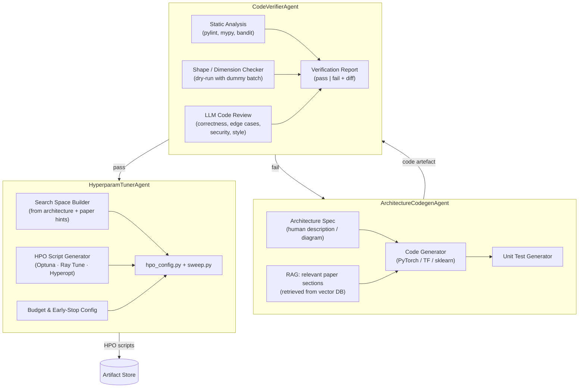
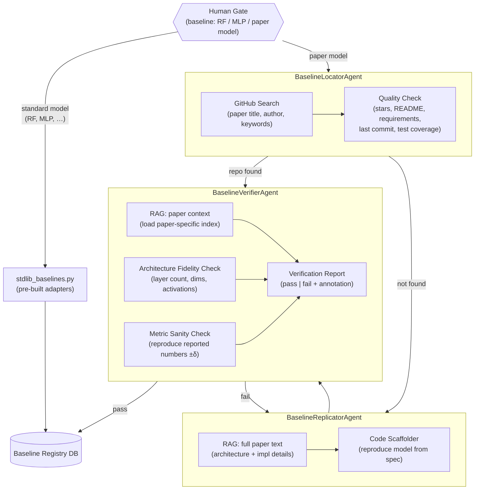
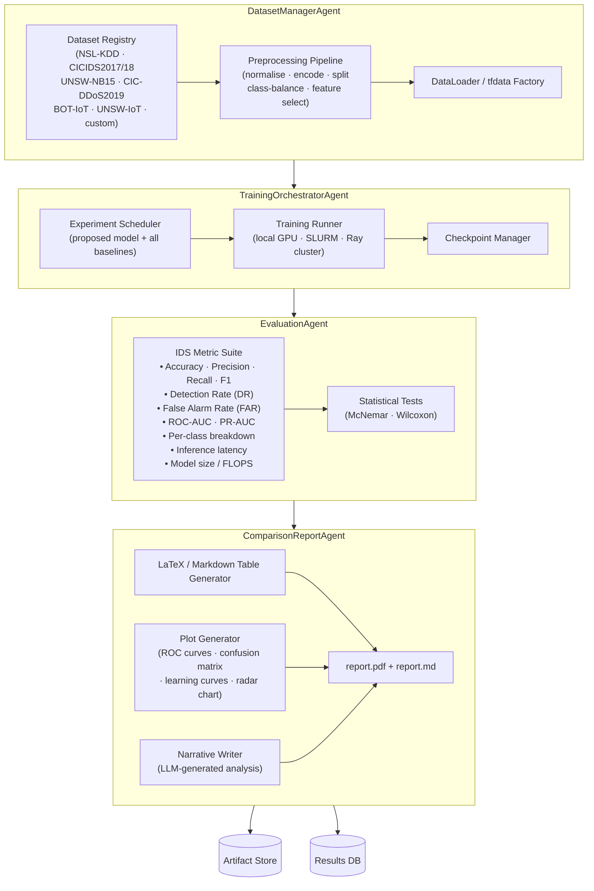
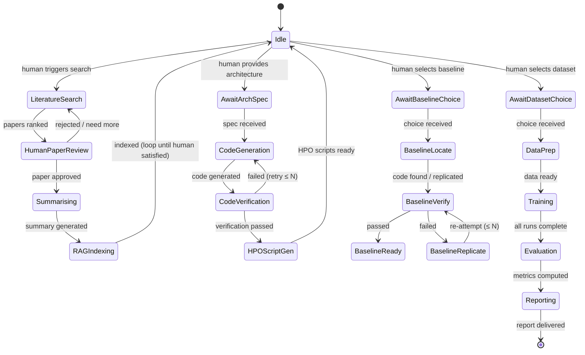
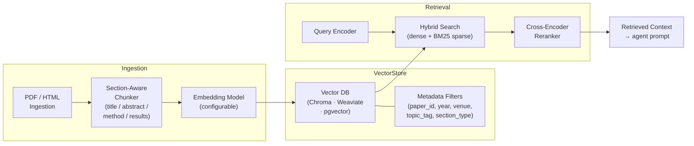
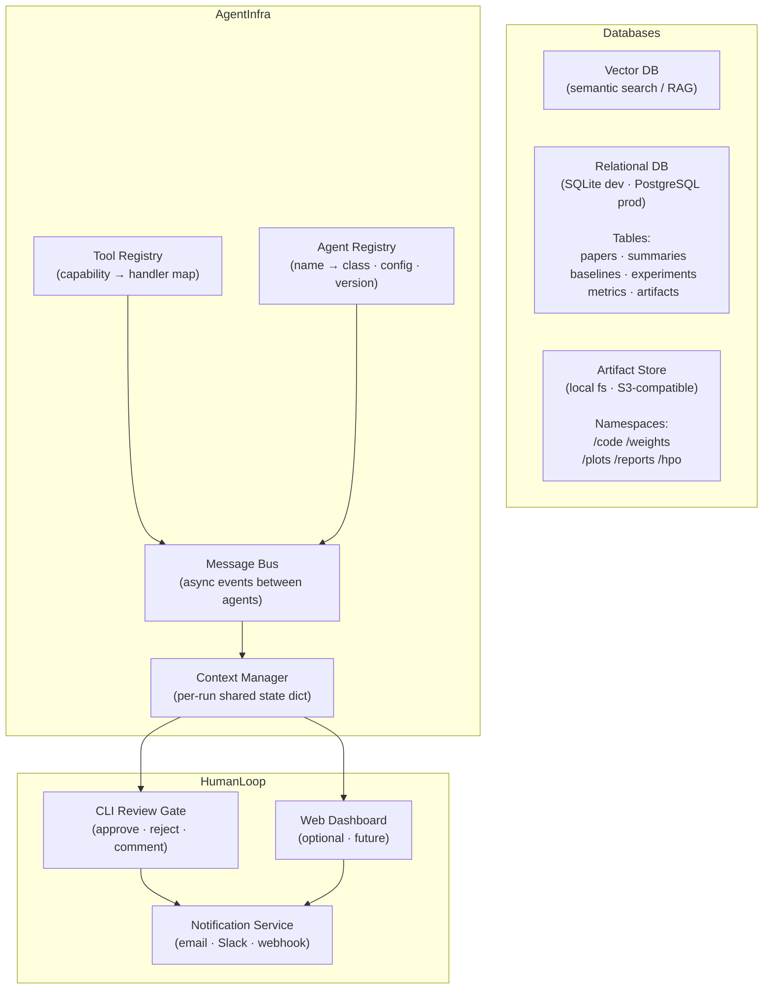

# ML-IDS Research & Development Agent System — Architecture

## Overview

This system automates the full research-to-evaluation pipeline for Machine Learning-based
Intrusion Detection Systems (ML-IDS).  A human stays in the loop at every decision gate
(paper approval, architecture proposal, baseline selection, dataset selection) while all
mechanical work — literature summarisation, code generation, verification, training, and
comparison — is delegated to specialised agents.

```
Human decides WHAT.  Agents execute HOW.
```

---

## Top-Level Data Flow

```mermaid
flowchart TD
    H(["👤 Human"])

    subgraph LIT["① Literature Intelligence"]
        LA[Literature Search Agent]
        HG1{{"Human Gate\n(approve / reject paper)"}}
        SUM[Summary Generator Agent]
        RAG_IDX[RAG Indexing Agent]
    end

    subgraph DEV["② Model Development"]
        HG2{{"Human Gate\n(propose architecture)"}}
        CODEGEN[Architecture Codegen Agent]
        HPT[Hyperparameter Tuner Agent]
        CV[Code Verifier Agent]
    end

    subgraph BASE["③ Baseline Pipeline"]
        HG3{{"Human Gate\n(select baseline)"}}
        BL_LOC[Baseline Locator Agent\n(GitHub search)]
        BL_REP[Baseline Replicator Agent]
        BLV[Baseline Verifier Agent]
    end

    subgraph EVAL["④ Experiment & Evaluation"]
        HG4{{"Human Gate\n(select dataset)"}}
        DS[Dataset Manager Agent]
        TRAIN[Training Orchestrator Agent]
        METRICS[Evaluation Agent]
        REPORT[Comparison Report Agent]
    end

    subgraph INFRA["Shared Infrastructure"]
        VECDB[(Vector DB\nRAG Store)]
        RELDB[(Relational DB\nFindings & Results)]
        ART[(Artifact Store\nCode / Weights / Plots)]
        TOOLS[Tool Registry]
    end

    H -->|"search query / filters"| LA
    LA --> HG1
    HG1 -->|approved| SUM
    HG1 -->|rejected| LA
    SUM --> RAG_IDX
    SUM --> RELDB
    RAG_IDX --> VECDB

    H -->|"architecture spec"| HG2
    HG2 --> CODEGEN
    CODEGEN --> CV
    CV -->|"pass"| HPT
    CV -->|"fail + diff"| CODEGEN
    HPT --> ART

    H -->|"baseline choice"| HG3
    HG3 --> BL_LOC
    BL_LOC -->|"repo found"| BLV
    BL_LOC -->|"not found"| BL_REP
    BL_REP --> BLV
    BLV -->|"pass"| RELDB
    BLV -->|"fail + diff"| BL_REP

    H -->|"dataset choice"| HG4
    HG4 --> DS
    DS --> TRAIN
    TRAIN -->|"proposed model"| METRICS
    TRAIN -->|"all baselines"| METRICS
    METRICS --> REPORT
    REPORT --> RELDB
    REPORT --> ART

    VECDB -.->|RAG context| SUM
    VECDB -.->|RAG context| CODEGEN
    VECDB -.->|RAG context| BL_REP
    VECDB -.->|RAG context| BLV
    VECDB -.->|RAG context| CV
    TOOLS -.->|shared tools| LA & SUM & CODEGEN & BL_LOC & BL_REP & CV & BLV & TRAIN & METRICS
```

---

## Agent Catalogue

### ① Literature Intelligence Layer



**Key tools exposed by this layer**

| Tool | Purpose |
|------|---------|
| `search_papers(query, filters)` | Unified multi-source search |
| `fetch_full_text(paper_id)` | PDF / HTML retrieval |
| `extract_structured_summary(text)` | LLM-based field extraction |
| `index_paper(paper_id, chunks)` | Embed + store in vector DB |
| `retrieve_similar_papers(query, k)` | RAG retrieval for downstream agents |

---

### ② Model Development Layer



---

### ③ Baseline Pipeline



> **Separation guarantee**: `BaselineVerifierAgent` is a *distinct* agent from
> `BaselineReplicatorAgent` — it gets only the paper RAG context and the candidate code;
> it has no memory of the replication session.

---

### ④ Experiment & Evaluation Layer



---

## Orchestrator State Machine

The **OrchestratorAgent** drives the entire pipeline as a state machine.
Each state corresponds to a pipeline phase; transitions require either an
agent completion event or explicit human approval.



---

## RAG Architecture

All knowledge-intensive agents share a unified RAG layer.



**Named RAG indices**

| Index name | Contents | Used by |
|------------|----------|---------|
| `papers_global` | All approved papers | SummaryGeneratorAgent, CodegenAgent |
| `paper_{id}` | Single paper (per-paper index) | BaselineVerifierAgent |
| `code_snippets` | OSS IDS implementations | BaselineReplicatorAgent |
| `datasets_meta` | Dataset cards & schema docs | DatasetManagerAgent |

---

## Shared Infrastructure



---

## Module / Package Layout

```
ids_agent/
│
├── orchestrator.py          # OrchestratorAgent + pipeline state machine
├── config.py                # Pydantic settings (env vars, paths, model IDs)
│
├── agents/
│   ├── base.py              # BaseAgent ABC (run, tools, rag_client, logger)
│   ├── literature.py        # LiteratureSearchAgent, SummaryGeneratorAgent
│   ├── rag_indexing.py      # RAGIndexingAgent
│   ├── codegen.py           # ArchitectureCodegenAgent, HyperparamTunerAgent
│   ├── verification.py      # CodeVerifierAgent, BaselineVerifierAgent
│   ├── baseline.py          # BaselineLocatorAgent, BaselineReplicatorAgent
│   └── evaluation.py        # DatasetManagerAgent, TrainingOrchestratorAgent,
│                            #   EvaluationAgent, ComparisonReportAgent
│
├── rag/
│   ├── indexer.py           # PDF parsing, chunking, embedding, upsert
│   ├── retriever.py         # Hybrid search + reranking
│   └── indices.py           # Named index definitions & metadata schemas
│
├── tools/
│   ├── registry.py          # Tool registration decorator + lookup
│   ├── paper_search.py      # arXiv, Semantic Scholar, IEEE connectors
│   ├── github_search.py     # GitHub code search + quality scoring
│   ├── code_analysis.py     # pylint, mypy, bandit wrappers
│   ├── dataset_loader.py    # Public IDS dataset downloaders & preprocessors
│   └── metrics.py           # IDS metric suite (DR, FAR, ROC-AUC, …)
│
├── db/
│   ├── schema.py            # SQLAlchemy models
│   ├── migrations/          # Alembic migration scripts
│   └── repositories.py      # Data-access layer (PaperRepo, ExperimentRepo, …)
│
├── human_loop/
│   ├── gate.py              # HumanGate base class (blocks until decision)
│   ├── cli_gate.py          # Rich-based terminal review UI
│   └── webhook_gate.py      # HTTP callback gate (for web dashboard / CI)
│
├── baselines/
│   ├── stdlib_baselines.py  # Pre-built adapters: RF, MLP, SVM, XGBoost
│   └── adapters/            # One file per replicated paper model (auto-generated)
│
├── plugins/                 # Drop-in extensions (new agents, data sources, metrics)
│   └── README.md
│
└── tests/
    ├── unit/
    └── integration/
```

---

## Expandability Design

The system is built around three extension points that require **zero changes** to
existing code:

### 1. New Agent
Subclass `BaseAgent`, implement `run()`, register via decorator:

```python
# ids_agent/agents/my_new_agent.py
from ids_agent.agents.base import BaseAgent
from ids_agent.tools.registry import register_agent

@register_agent("my_new_agent")
class MyNewAgent(BaseAgent):
    async def run(self, ctx: dict) -> dict: ...
```

### 2. New Tool
```python
# ids_agent/tools/my_tool.py
from ids_agent.tools.registry import tool

@tool(name="fetch_patent", tags=["literature"])
def fetch_patent(patent_id: str) -> dict: ...
```

### 3. New RAG Index
```python
# ids_agent/rag/indices.py  — add one entry
INDICES["patent_corpus"] = IndexConfig(
    embedding_model="text-embedding-3-large",
    chunk_size=512,
    metadata_schema=PatentMeta,
)
```

### Planned Future Modules

| Module | Purpose |
|--------|---------|
| `agents/adversarial.py` | Adversarial robustness evaluation (FGSM, PGD on IDS) |
| `agents/explainability.py` | SHAP / LIME feature-importance reporter |
| `agents/continuous_monitor.py` | Live traffic ingestion + drift detection |
| `agents/federated.py` | Federated learning coordinator across network nodes |
| `plugins/openml_connector.py` | Pull datasets from OpenML registry |
| `plugins/mlflow_tracker.py` | MLflow experiment tracking integration |
| `human_loop/web_gate.py` | Full web dashboard for review portal |

---

## Human-in-the-Loop Checkpoints Summary

| Gate | Blocks on | Agent resumes when |
|------|----------|--------------------|
| **Paper Approval** | Each retrieved paper | Human marks approve / reject |
| **Architecture Proposal** | Architecture specification | Human submits spec text/diagram |
| **Baseline Selection** | Baseline model identity | Human names model or paper |
| **Dataset Selection** | Dataset choice | Human names dataset + split config |
| **Verification Override** | Code fails > N retries | Human reviews diff and decides |

---

## Technology Recommendations

| Concern | Recommended choice | Alternatives |
|---------|-------------------|-------------|
| LLM backbone | `claude-sonnet-4-6` (codegen, summaries) | GPT-4o, Gemini 1.5 Pro |
| Embeddings | `text-embedding-3-large` | BGE-M3, Cohere embed-v3 |
| Vector DB | ChromaDB (dev) · Weaviate (prod) | pgvector, Pinecone |
| Relational DB | SQLite (dev) · PostgreSQL (prod) | DuckDB |
| HPO framework | Optuna | Ray Tune, Hyperopt |
| Training runtime | PyTorch + Lightning | TensorFlow/Keras |
| Static analysis | pylint + mypy + bandit | ruff, semgrep |
| Async message bus | asyncio queues (dev) · Redis Streams (prod) | RabbitMQ, Kafka |
| Artifact store | Local filesystem (dev) · MinIO / S3 (prod) | DVC |
